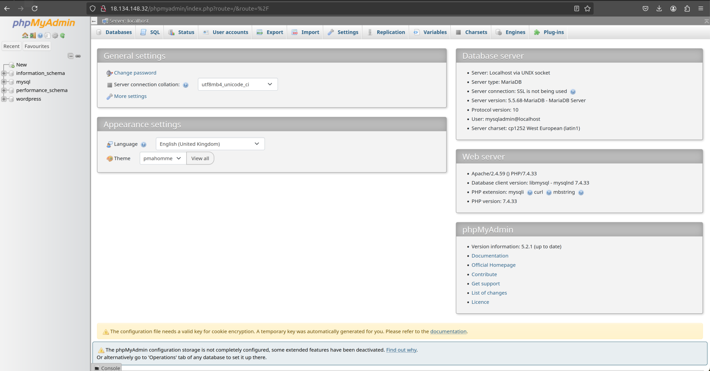

# EC2 WordPress Terraform Deployment

This project demonstrates the deployment of a WordPress site on an EC2 instance using Terraform. The configuration creates a public subnet by associating a route table with an Internet Gateway, making the instances in the subnet accessible from the internet. The deployment includes setting up a VPC, subnet, internet gateway, route table, security group, EC2 instance, and an Elastic IP.

SSH on to the EC2 instance and configure the webserver with further installation of Apache, PHP, MySQL and phpMyAdmin.

# Architecture

[](https://www.linux.org/)
[](https://www.terraform.io/)
[](https://aws.amazon.com/)


# Table of Contents

1. [Prerequisites](#prerequisites)
2. [Installation](#installation)
3. [Configuration](#configuration)
4. [Deployment](#deployment)
5. [Accessing WordPress Site](#accessing-wordpress-site)
6. [Cleanup](#cleanup)

## Prerequisites

- Congifured AWS account
- AWS CLI configured with secure credentials
- Terraform installed on local machine
- SSH key pair for EC2 instance access

## Installation

2.1 Install AWS CLI:

```sh
    sudo apt-get install awscli      # Debian/Ubuntu
    brew install awscli              # macOS
    choco install awscli             # Windows
```

2.2 Configure AWS CLI:

```sh
    aws configure
    # Requires AWS Access Key, Secret Access Key, Region, Output Format ('json')
```

2.3 Install Terraform:
Follow the instructions on the [Terraform](https://developer.hashicorp.com/terraform/tutorials/aws-get-started/install-cli) documentation.

## Configuration

3.1 Clone the repo:

```sh
    git clone https://github.com/sohailsajid79/EC2-WordPress-Terraform-Deployment.git
    cd ec2-wordpress-terraform-deployment
```

3.2 Update the Terraform configuration (main.tf) with the SSH key pair:

## Deployment

```sh
    terraform init
    # Initialise deployment
```

```sh
    terraform plan
    # Generate and review execution plan
```

```sh
    terraform apply
    # Apply configuration to create the resources in AWS
    # 'yes' to confirm the execution plan
```

## Accessing WordPress Site

5.1 Access via SSH:

```sh
    ssh -i <key.pem> ec2-user@<18.134.148.32>

    # Replace <key.pem> with your own key file path and <public_ip_address> with the IP address of your EC2 instance.
```


5.2 Additional Configuration:

- Install Apache, PHP & MariaDB:

  - `sudo yum update -y`
  - `sudo amazon-linux-extras enable php7.4`
  - `sudo yum clean metadata`
  - `sudo yum install -y httpd php php-mysqlnd mariadb-server`

- Start, Enable Apache & MariaDB:

  - `sudo systemctl start httpd`
  - `sudo systemctl enable httpd`
  - `sudo systemctl start mariadb`
  - `sudo systemctl enable mariadb`

- Secure MariaDB Installation:

  - `sudo mysql_secure_installation`

- Login MariaDB:

  - `sudo mysql -u root -p`

- Create DB & WordPress User:

  - `CREATE DATABASE wordpress;`
  - `CREATE USER 'mysqladmin'@'localhost' IDENTIFIED BY 'password';`
  - `GRANT ALL PRIVILEGES ON wordpress.\* TO 'mysqladmin'@'localhost';`
  - `FLUSH PRIVILEGES;`
  - `EXIT;`

- Download, Extract & Configure WordPress:

  - `cd /var/www/html`
  - `sudo wget http://wordpress.org/latest.tar.gz`
  - `sudo tar -xvzf latest.tar.gz`
  - `sudo cp -r wordpress/* /var/www/html/`
  - `sudo rm -rf wordpress latest.tar.gz`
  - `sudo chown -R apache:apache /var/www/html/`
  - `sudo systemctl restart httpd`

    - Configure WordPress 'wp-config.php' file:

      - `sudo cp /var/www/html/wp-config-sample.php /var/www/html/wp-config.php`
      - `sudo vi /var/www/html/wp-config.php`

        ```sh
          // ** MySQL settings ** //
              define('DB_NAME', 'wordpress');
              define('DB_USER', 'mysqladmin');
              define('DB_PASSWORD', 'password');
              define('DB_HOST', 'localhost');
              define('DB_CHARSET', 'utf8');
              define('DB_COLLATE', '');
        ```

      - `sudo systemctl restart httpd`

- Download & Extract phpMyAdmin GUI

  - `cd /usr/share`
  - `sudo wget https://www.phpmyadmin.net/downloads/phpMyAdmin-latest-all-languages.tar.gz`
  - `sudo tar -xvzf phpMyAdmin-latest-all-languages.tar.gz`
  - `sudo mv phpMyAdmin-*-all-languages phpmyadmin`
  - `sudo rm phpMyAdmin-latest-all-languages.tar.gz`

- Configure Apache for phpMyAdmin

  - `sudo vi /etc/httpd/conf.d/phpmyadmin.conf`

    ```sh
          <Directory /usr/share/phpmyadmin/>
            AddDefaultCharset UTF-8

            <IfModule mod_authz_core.c>
              # Apache 2.4
              <RequireAny>
                Require all granted
              </RequireAny>
            </IfModule>
            <IfModule !mod_authz_core.c>
              # Apache 2.2
              Order Deny,Allow
              Deny from All
              Allow from All
            </IfModule>
          </Directory>
    ```

  - `sudo chown -R apache:apache /usr/share/phpmyadmin`
  - `sudo systemctl restart httpd`

- Secure phpMyAdmin with .htaccess Authentication

  - `sudo chown -R apache:apache /usr/share/phpmyadmin`
    #Within <Directory "/var/www/html"> change AllowOverride None > AllowOverride All.
  - `sudo systemctl restart httpd`
  - `sudo vi /usr/share/phpmyadmin/.htaccess`
    ```sh
        AuthType Basic
        AuthName "Rrestricted Access"
        AuthUserFiles /etc/phpmyadmin/.htpasswd
        Require valid-user
    ```
  - `sudo mkdir /etc/phpmyadmin`
  - `sudo htpasswd -c /etc/phpmyadmin/.htpasswd`

Access WordPress from the Front-End:

```sh
    http://18.134.148.32/wp-admin/
```


Access phpMyAdmin from the Front-End::

```sh
    http://18.134.148.32/phpmyadmin
```



## Cleanup

Avoid incurring charges by destroying the infrastructure when no longer needed:

```sh
    terraform destroy
```
