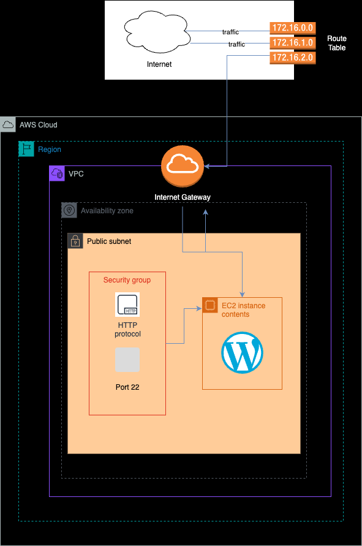
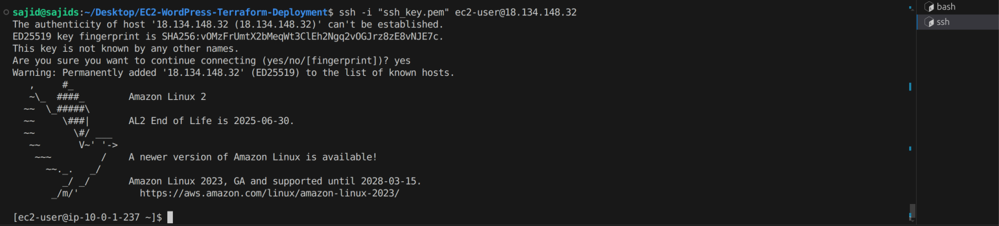
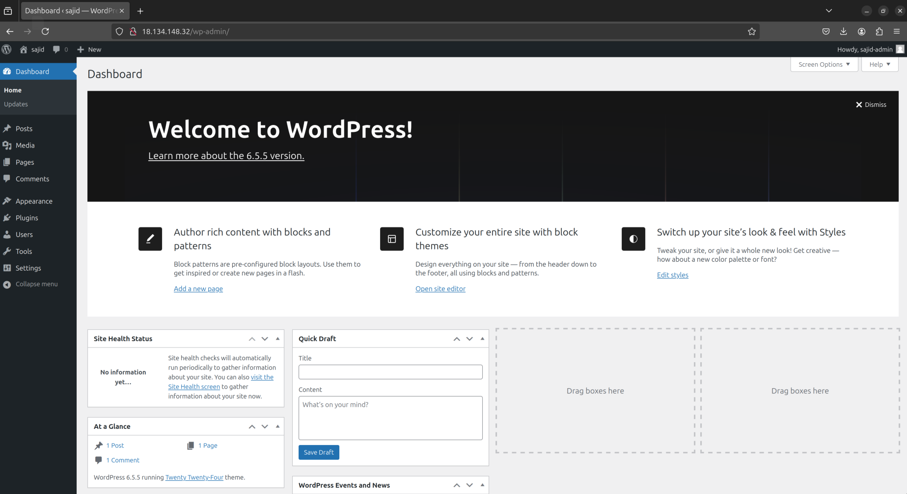

# EC2 WordPress Terraform Deployment

This project demonstrates the deployment of a WordPress site on an EC2 instance using Terraform. The configuration creates a public subnet by associating a route table with an Internet Gateway, making the instances in the subnet accessible from the internet. The deployment includes setting up a VPC, subnet, internet gateway, route table, security group, EC2 instance, and an Elastic IP.

# Architecture

[](https://www.linux.org/)
[](https://www.terraform.io/)
[](https://aws.amazon.com/)



# Table of Contents

1. [Prerequisites](#prerequisites)
2. [Installation](#installation)
3. [Terraform Configuration](#terraform-configuration)
4. [Deployment](#deployment)
5. [Accessing WordPress Site](#accessing-wordpress-site)
6. [Cleanup](#cleanup)

## Prerequisites

- Congifured AWS account
- AWS CLI configured with secure credentials
- Terraform installed on local machine
- SSH key pair for EC2 instance access

## Installation

1. Install AWS CLI:

```sh
    sudo apt-get install awscli      # Debian/Ubuntu
    brew install awscli              # macOS
    choco install awscli             # Windows
```

2. Configure AWS CLI:

```sh
    aws configure
    # Requires AWS Access Key, Secret Access Key, Region, Output Format ('json')
```

3. Install Terraform:
   Follow the instructions on the [Terraform](https://developer.hashicorp.com/terraform/tutorials/aws-get-started/install-cli) documentation.

## Configuration

1. Clone the repo:

```sh
    git clone https://github.com/sohailsajid79/EC2-WordPress-Terraform-Deployment.git
    cd ec2-wordpress-terraform-deployment
```

2. Update the Terraform configuration (main.tf) with the SSH key pair:

## Deployment

```sh
    terraform init
    # Initialise deployment
```

```sh
    terraform plan
    # Generate and review execution plan
```

```sh
    terraform apply
    # Apply configuration to create the resources in AWS
    # 'yes' to confirm the execution plan
```

## Accessing WordPress Site

1. Access via SSH:

```sh
    ssh -i <key.pem> ec2-user@<public_ip_address>

    # Replace <key.pem> with your key file path and <public_ip_address> with the IP address of your EC2 instance.
```



2. Additional Configuration:

- Install, Start and Enable Apache:

  - `sudo yum install -y httpd`
  - `sudo systemctl start httpd`
  - `sudo systemctl enable httpd`

- Install PHP & MySQL and Enable:

  - `sudo yum install -y php php-mysqlnd mariadb-server`
  - `sudo amazon-linux-extras enable php7.4`
  - `sudo yum clean metadata`
  - `sudo yum install php php-cli php-common php-mbstring php-xml php-mysqlnd`
  - `sudo systemctl start mariadb`
  - `sudo systemctl enable mariadb`

- Set Up MySQL:

  - `sudo mysql_secure_installation`

- Login MySQL:

  - `sudo mysql -u root -p`

- Create DB & WordPress User:

  - `CREATE DATABASE wordpress;`
  - `CREATE USER 'wordpressuser'@'localhost' IDENTIFIED BY 'password';`
  - `GRANT ALL PRIVILEGES ON wordpress.\* TO 'wordpressuser'@'localhost';`
  - `FLUSH PRIVILEGES;`
  - `EXIT;`

- Install WordPress:

  - `cd /var/www/html`
  - `sudo wget http://wordpress.org/latest.tar.gz`
  - `sudo tar -xvzf latest.tar.gz`
  - `sudo cp -r wordpress/* /var/www/html/`
  - `sudo rm -rf wordpress latest.tar.gz`
  - `sudo chown -R apache:apache /var/www/html/`
  - `sudo systemctl restart httpd`

- Configure WordPress
  - `sudo cp /var/www/html/wp-config-sample.php /var/www/html/wp-config.php`
  - `sudo vi /var/www/html/wp-config.php`

```sh
    // ** MySQL settings ** //
        define('DB_NAME', 'wordpress');
        define('DB_USER', 'wordpressuser');
        define('DB_PASSWORD', 'password');
        define('DB_HOST', 'localhost');
        define('DB_CHARSET', 'utf8');
        define('DB_COLLATE', '');
```

3. Access WordPress in the browser:

```sh
    http://18.134.148.32/wp-admin/
```



## Cleanup

Avoid incurring charges by destroying the infrastructure when no longer needed:

```sh
    terraform destroy
```
